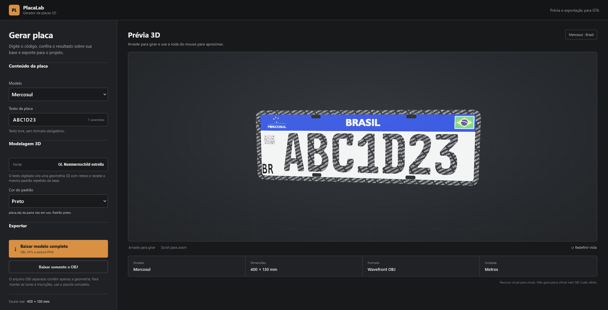

<div align="center">

# PlacaLab 3D

### Gerador de placas brasileiras em 3D para mods de GTA

[](https://gustavo-bozzano.github.io/gerador-placa/)
[](https://threejs.org/)
[](https://pages.github.com/)

Crie a identificação da placa, confira o resultado em uma prévia 3D interativa e baixe o modelo pronto para usar no seu projeto.



</div>

## Recursos

- Placa **Mercosul** e placa **cinza antiga**.
- Texto livre, sem validação de formato.
- Prévia 3D com rotação e zoom.
- Caracteres gerados dinamicamente como geometria 3D.
- Fontes **GL Nummernschild**, **Mandatory** e **DIN 1451**, conforme o modelo escolhido.
- Padrão das letras Mercosul nas cores preta, azul e vermelha.
- Cidade e UF personalizáveis na placa antiga.
- Base carregada diretamente de `placa.obj` ou `placa_antigo.obj`.
- Exportação somente em `.obj` ou pacote completo com `.obj`, `.mtl` e texturas `.png`.
- Modelo em escala real de **400 × 130 mm**, usando metros como unidade.

## Como usar

1. Acesse o [PlacaLab 3D](https://gustavo-bozzano.github.io/gerador-placa/).
2. Escolha entre **Mercosul** e **Cinza antiga**.
3. Digite o texto desejado.
4. Ajuste a cor, a fonte, a cidade e a UF quando essas opções estiverem disponíveis.
5. Arraste a prévia para girar o modelo e use a roda do mouse para controlar o zoom.
6. Baixe somente o OBJ ou o pacote completo com materiais e texturas.

## Arquivos exportados

O pacote completo inclui os arquivos necessários para manter a aparência do modelo em programas 3D:

```text
placa_mercosul_preto_ABC1D23.zip
├── placa_mercosul_preto_ABC1D23.obj
├── placa_mercosul_preto_ABC1D23.mtl
├── placa_mercosul_preto_ABC1D23.png
├── placa_padrao_preto.png
└── placa_textura.png
```

O OBJ contém somente a placa e os caracteres. Câmera, iluminação e cenário da prévia não fazem parte do arquivo exportado.

## Usar seus próprios modelos

As bases ficam na raiz do projeto:

| Modelo | Malha | Material | Textura |
| --- | --- | --- | --- |
| Mercosul | `placa.obj` | `placa.mtl` | `placa.png` e `padrao*.png` |
| Cinza antiga | `placa_antigo.obj` | `placa_antigo.mtl` | `placa_antigo.png` |

Ao substituir uma base, mantenha o nome do arquivo e exporte o mapa UV junto com o OBJ. O site busca a versão mais recente dos arquivos a cada carregamento.

## Desenvolvimento

O projeto é estático e não exige instalação ou processo de compilação. Para testar alterações, abra a pasta usando um servidor local, como a extensão **Live Server** do VS Code. A conexão com a internet é necessária para carregar o Three.js e as demais bibliotecas externas.

Arquivos principais:

```text
gerador-placa/
├── index.html
├── styles.css
├── font-data.js
├── placa.obj
├── placa_antigo.obj
└── .github/workflows/deploy-pages.yml
```

## Publicação

Cada atualização enviada para a branch `master` inicia a publicação automática no GitHub Pages. O repositório precisa estar configurado em **Settings → Pages → GitHub Actions**.

## Aviso

Este projeto foi criado como recurso visual para mods. Ele não emite identificação veicular oficial e não gera QR Code válido.

<div align="center">

Feito para a comunidade de modding de GTA.

</div>
